#CSS
  * style样式需要指定使用范围(./h1/h2/p)
  * 使用/* */来表示注释
  * 用字符'#'来表示id
  * 用字符'.'来表示类
  * 多个样式表从上到下排列,越下面越优先

##浏览器指定
  * -webkit:苹果；谷歌，等一些浏览器认，因为他们都用的是webkit内核
  * -moz:主要是专门支持Mozilla Firefox 火狐浏览器的CSS属性
  * -o:Opera
  * -ms:IE

##查找样式
  * css中匹配的类选择器
  * 查看父类的类选择器
  * 使用默认值
  * 存在多个个规则时,更加特定的规则会被执行
  * 同样优先级规则时,看**css文件中靠后的**

##Style样式
  * color:字体颜色
  * background-color:背景色
  * background-image:背景图
  * font-family:字体
  * font-size:字体大小(px/%/em/xx-small/x-small/small/medium/large/x-large/xx-large)
  * font-weight:字体粗细
  * font-style:是否斜体(italic/oblique)
  * border:边框
  * border-bottom:下划线
  * left/right/top/bottom:指定左/右/上/下所在的位置
  * line-height:行间距
  * padding:内边距
  * text-align:文本对齐(left/right/center)
  * test-decoration:增加风格
  * letter-spacing:字母间距
  * list-style:列表外观
  * background-image:背景图
  * background-repeat:是否重复(repeat/repeat-x/repeat-y/no-repeat/inherit)
  * background-position:背景位置
  * float:悬浮位置(left/right)
  * clear:指定位置不允许有悬浮内容
  * position:位置属性(fixed/static/relative/absoulte)
  * diaplay:布局方式(table)

##类选择器
  * html中使用class属性来指定类选择器

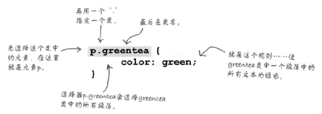

##关于颜色
支持了16中标准颜色,其他需要用16进制来表示
  * aqua(水绿)
  * black(黑)
  * blue(蓝)
  * fuchsia(紫红)
  * gray(灰)
  * green(绿)
  * lime(浅绿)
  * maroon(褐)
  * navy(深蓝)
  * olive(橄榄)
  * purple(紫)
  * red(红)
  * silver(银)
  * teal(深青)
  * white(白)
  * yellow(黄)

##关于粗细:
有四种粗细表示程度,默认为normal
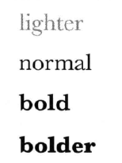

##关于文本装饰器:
有四种文本风格程度,默认为none,可以同时指定多个,(overline为上划线)
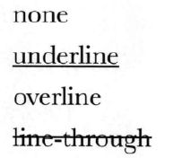

##关于字体规范
每个字体规范中都是字体的表现形式,多个字体使用逗号隔开,系统依次选择

  * sans_serif:没有衬线的字体,外观清晰,计算机易识

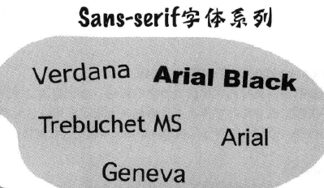

  * serif:有衬线的字体,高雅传统,可读性好,适合新闻报纸的排版

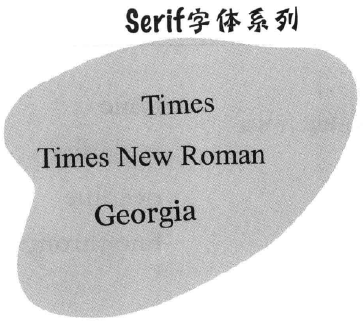

  * monospace:固定宽度的字,类似打字机打出来的

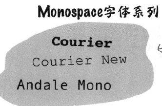

  * cursive:类似手写的字,有趣味/有风格

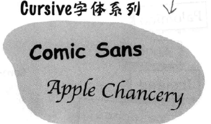

  * cursive:包含某种风格,有趣味/有风格

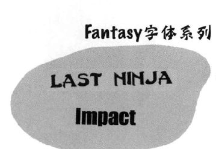

##字体格式
  * ttf:TrueType是Apple公司和Microsoft公司共同推出的字体文件格式
  * otf:OpenType是ttf的超集
  * woff:在ttf基础上的web字体标准
  * svg:Soalable Vector Graphics是图像格式字体
  * eot:OpenType的压缩形式

##web字体
  * css中使用@font-face规则,内置css规则
  * 使用font-family来建立字体名
  * 使用src属性指明字体路径 src:url("xxx.ttf"),url("xxx.woff")
  * 在css中指定建立的字体

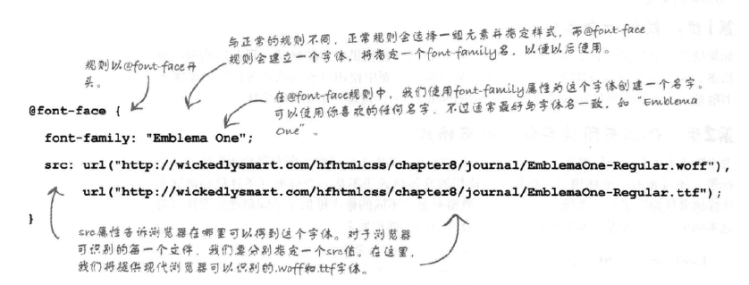

##盒模型
  * css中元素都被当作盒模型来看待
  * 从内到外为:content area/padding/border/margin
  * 内容区(content area):包含的是主要内容,width属性只会影响此区域大小
  * 内边距(padding):边框和主体的剧,**会继承内容区的颜色样式**
  * 边框(border):边框长度
  * 外边距(margin):边框距外的距离

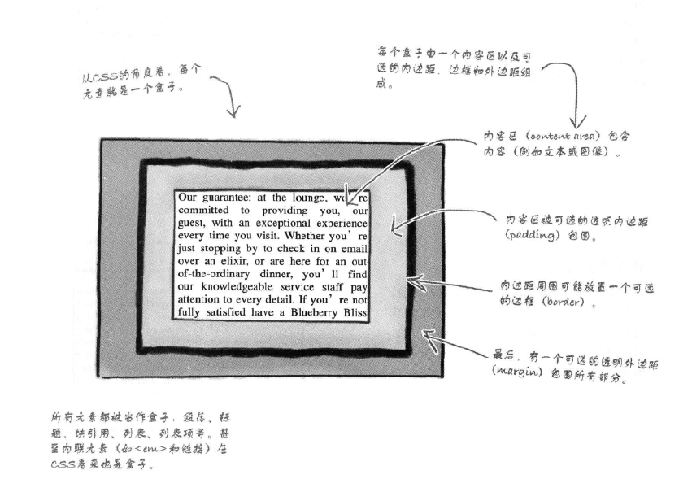

##边框样式
  * solid:实线
  * double:双实线
  * groove:槽线
  * outset:外凸
  * dotted:虚线
  * dashed:破折线
  * inset:内凹
  * rigid:脊线

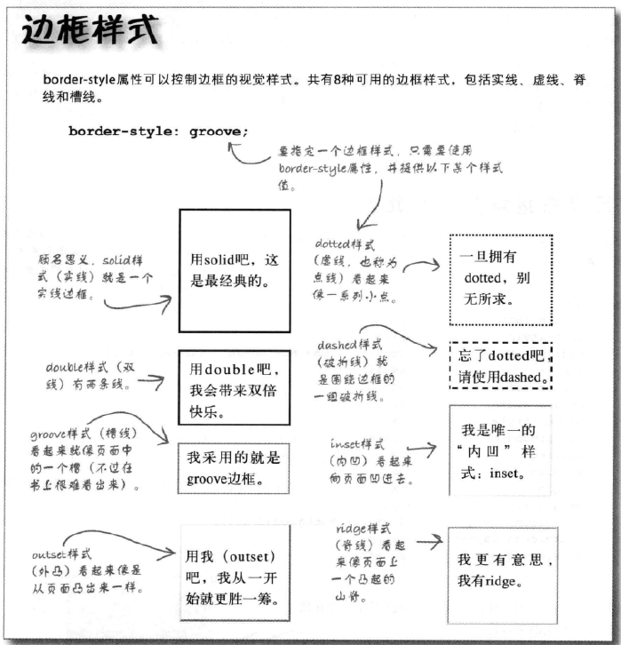
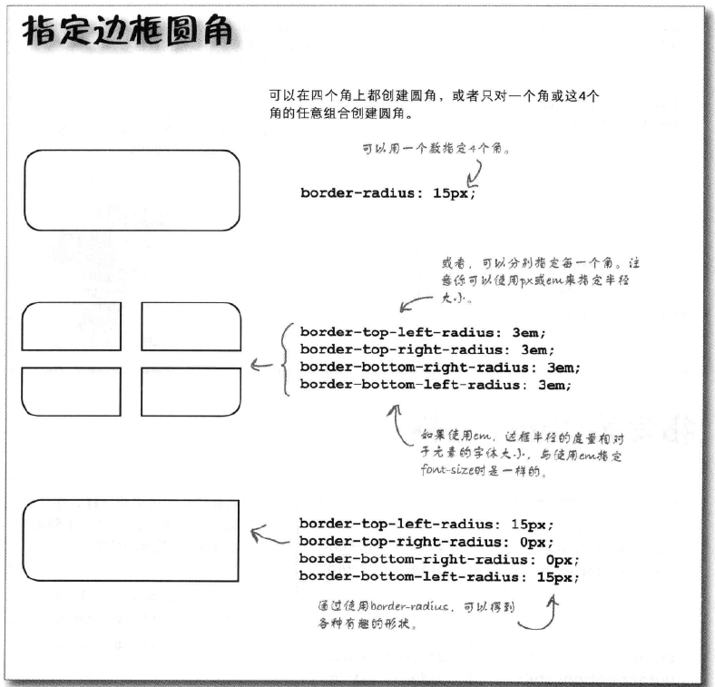

##媒体
  * css中使用@media来表示媒体(后面接print/screen等各类媒体)
  * 可以通过(min-device-width/max-device-width)获取页面信息
  * print:打印机
  * screen:窗口
  * min-device-width:页面最小宽度
  * max-device-width:

##层叠
  * 作者>读者>浏览器
  * id>类/伪类>元素名
  * css中定义顺序:定义后>定义前

##布局
  * 浏览器使用流在页面中放置元素
  * 块元素从上向下流,各元素之间有一个换行.默认每个快元素会占整个窗口的宽度
  * 內联元素块元素内部从左上方流向右下方.在垂直方向上扩展来包含这些块元素
  * 流体布局:float
    * 从正常流中取出,浮到左边或者右边
    * 无法创建两个相同高度的列
    * 使用clear来指定块元素的左/右不能有浮动元素,浮动元素会下移
    * 浮动元素必须有宽度且不能为auto
  * 冻结布局:设置固定的width
  * 凝胶布局:auto
    * 不会填满整个页面(很多blog采用此布局)
    * 内容宽度是固定的,外边距会随着浏览器窗口扩展或收缩
    * 通常把内容放在中央
  * 绝对定位布局:position
    * 使用top/bottom/right/left来指定元素的位置
    * 使用fixed/static/relative/absoulte来指定位置属性
    * 使用z-index来分层
  * 表格显示布局:table
 

##css表格
  * 是一种布局的方式
  * 使用多个嵌套的display标签来完成多行的行为
  * boder来设置边框
  * vertial-align:设置垂直对齐方式(top/middle/bottom)
  * padding来设置边距
  * display来设置行列(table-row/table-column)
  * first-child表示第一个元素

##html表格
  * 一种处理数据方式
  * caption-side:指定标题的位置(top/bottom/left/right)\
  * border:表格的边框属性
  * border-collapse:是否折叠(separate/collapse)
  * border-spacing:边框空隙

##display:
  * block:区块(带回车)
  * inline:內联(没有回车)
  * table:表格
  * none:不显示